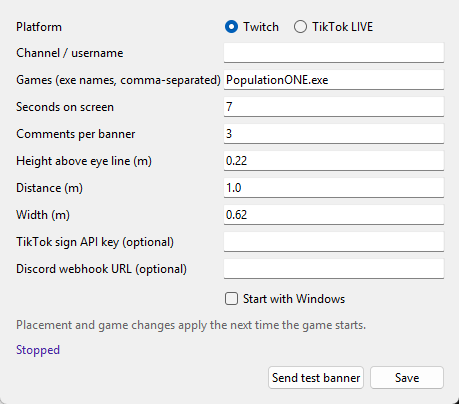
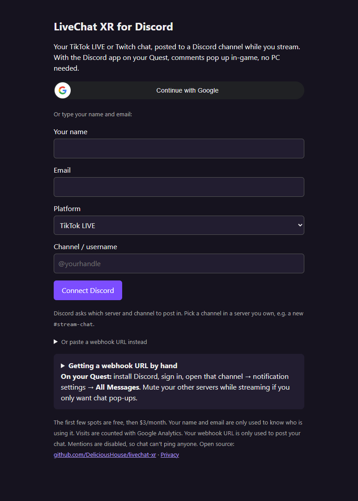

# Get stream chat into your headset

Choose a path, connect your stream, then send a test before going live.

## Choose your path

| You play… | Use… | What you need |
|---|---|---|
| PCVR, with the game running on a Windows PC | [PC overlay](#pc-first-run) | Windows 10/11 x64, an OpenXR game using Direct3D 11, administrator rights to install |
| Quest standalone, with the game running on the headset | [Hosted Discord relay](#quest-first-run) | Quest 2, Quest Pro or Quest 3 series, Discord, a server/channel you control, browser access. No LiveChat XR PC app |

Both accept TikTok LIVE or Twitch. A Quest connected to a PC by Link/Air Link or Virtual Desktop is PCVR, not standalone. OpenXR is the interface the PC game uses to talk to your headset; this overlay cannot draw in a game using a different interface or D3D12/Vulkan.

**Compatibility checkpoint:** the repo previously recorded the Meta PC version of Population: ONE on Quest 3 via Virtual Desktop as tested. Current docs do not re-certify that setup. The hosted relay posts to Discord; actual notifications over a standalone game and a five-minute setup are not yet verified by newcomer QA. Test on your own headset before relying on it during a stream.

## PC first run

### Step 1: Install the Windows app

Open [GitHub Releases](https://github.com/DeliciousHouse/livechat-xr/releases). Expand **Assets**, download `LiveChatXR-Setup-<version>.exe`, not **Source code**, and run it. Choose a normal release rather than a pre-release unless you want to test it. The installer asks for administrator approval because it registers the VR layer for the machine. Keep the launch option selected at the end.

The installer is not currently code-signed. If Windows warns, first confirm the download came from the DeliciousHouse release page. See [installer troubleshooting](#troubleshooting) rather than disabling protection.

### Step 2: Save your stream settings

On a fresh setup, Settings opens automatically. If it does not, look for the purple chat icon in the Windows notification area (including hidden icons), right-click it, then choose **Settings…**.

Select **TikTok LIVE** or **Twitch**. For **Channel / username**, enter your actual account handle, not your display name. In the PC app use the bare handle (TikTok also accepts leading `@`; Twitch accepts leading `#`), not a profile URL.

For Population: ONE, leave **Games** as `PopulationONE.exe` if that matches your installed game's process. For another game, open Windows Task Manager while it runs, choose **Details**, and copy the executable name including `.exe`. Separate multiple games with commas. Leave placement and timing at their defaults for your first test. Leave both optional private fields empty for overlay-only use. Select **Start with Windows** if desired, then **Save**.

### Step 3: See a test banner

Start your PCVR game. Right-click the tray icon and choose **Send test banner**. You should see “LiveChat XR: test banner” near the top of your view for about seven seconds. This test does not need TikTok to be live. If it does not appear, use the checks below before proceeding.

Next, go live on your chosen platform and have someone else post a comment. Your own normal comments are skipped. New comments share one banner; gifts/support are gold. More than three selected lines become a `+N more` summary, and long text can be clipped. This is a quick glance at chat, not a full chat log.

### What you set up

The app reads stream chat; the VR layer draws it inside the chosen PC game. Restart the game after changing Games, placement or duration. Keep the tray app running. **Quit** stops new chat updates. To remove the layer, uninstall LiveChat XR through Windows Apps. Only use it with games that permit third-party OpenXR overlays; anti-cheat compatibility is not guaranteed.

## Quest first run

### Step 1: Install Discord on the headset

On Quest, open **Meta Horizon Store**, search for **Discord**, select **Install** or **Get**, then open it and sign in to your Discord account. You do not need a new account or the Windows installer. Discord's [official Quest announcement](https://discord.com/blog/discord-is-now-on-meta-quest-reach-out-to-your-servers-while-in-vr) links its setup FAQ; the [store page](https://www.meta.com/experiences/discord/25956082250713643/) lists availability. If the app is unavailable for your device/account, use Meta support rather than an unofficial APK.

Use a private Discord server and a text channel such as `stream-chat`. If you are new to Discord, its add-server **+** menu lets you create your own server. Use the same account on the headset and on the browser/phone where you do setup. Enable notifications for that channel, choose **All Messages**, and ensure the channel/server is not muted.

### Step 2: Connect your channel

Open [LiveChat XR](https://livechat.deliciouswines.org/) in your browser. Type your name and email, or choose **Continue with Google** if shown. Typing an email is a contact field, not an email login; no verification link is sent. Select TikTok LIVE or Twitch, then enter your handle. Here, unlike the PC app, a full TikTok/Twitch profile URL is also accepted; leading `@` is optional.

If **Connect Discord** is shown, choose it and select the server/text channel you control in Discord's authorization screen. If you prefer manual setup, expand **Or paste a webhook URL instead**, use the [webhook steps below](#how-to-make-a-discord-webhook), then choose **Connect with webhook**. Without one-click connection configured, the page instead shows **Discord webhook URL** and **Connect**.

You land on your private manage page. Keep its link private and bookmark it; it is also posted to the chosen Discord channel. A free registration starts listening immediately. If the free spots are taken, the page shows **waiting for payment** and plan choices. See [pricing](#pricing-and-billing). A signup confirmation is not proof that your stream or headset is connected.

### Step 3: Test before streaming

On your manage page choose **Send test message**. Check the message appears in the selected Discord channel, then check notifications on Quest, then test again with the standalone game open. You can send this test even while waiting for payment, but live chat forwarding stays paused until payment. “Test sent” on the webpage does not prove delivery. If you see the channel message but no in-game notification, use troubleshooting; do not assume the game supports it.

After that, go live and ask another person to comment. Keep the registration active; the hosted server listens again when you go live. You do not need to leave the browser open or run a PC app. Avoid also connecting the same Discord webhook in the Windows app: that can duplicate posts.

### What you set up

Your stream chat goes to a Discord channel. Discord and the Quest notification system handle display; LiveChat XR does not install an overlay into the standalone game. Use **Stop and delete** to remove the relay connection when no longer needed. Paid billing is cancelled separately below.

## How to make a Discord webhook

A webhook is a private address that lets LiveChat XR post messages to one Discord channel. It is not your Discord password, a server invite or a channel link. Anyone with the address can post there, so treat it like a password.

1. In Discord desktop or web, open a server you own and make a text channel for stream chat. Phone apps may not expose webhook administration; use Discord web/desktop if the option is missing.
2. Open that channel's settings (gear), then **Integrations → Webhooks → New Webhook**. Alternatively, use **Server Settings → Integrations → Create Webhook**, then select the intended text channel.
3. Name it **LiveChat XR**, choose the right channel, and press **Copy Webhook URL**. Paste directly into the relay form or optional PC Settings field. Do not put it in a screenshot, public post or support issue. Do not append `/github`.
4. Save/connect, then send a test from the app or private manage page. Confirm the actual channel received it.

If you cannot create a webhook, check that you own the server or have its **Manage Webhooks** permission. The one-click Connect Discord route can avoid manual copying. Discord's [webhook guide](https://support.discord.com/hc/en-us/articles/228383668-Intro-to-Webhooks) contains screenshots of its own settings; menus may change. LiveChat XR disables mentions so viewer text cannot ping everyone or roles.

## How to correct a stream name

Use the exact TikTok username on your profile, not the nickname shown on screen. You do not have to be live just to sign up. If the server says it cannot find your account, check spelling and LIVE eligibility. If it cannot verify TikTok right now, signup can still succeed with a note; confirm the status later.

On the hosted relay, return to signup with the **same manual Discord webhook**, then enter the corrected channel and connect. This updates the existing registration and preserves its plan/free spot. Creating a new webhook or using one-click Discord again may create a different webhook and a new registration; do not delete a paid registration just to fix its spelling. In the PC app, change Channel in Settings and save.

## Pricing and billing

The hosted relay's first **five available free registrations** are free; after that it offers **$3 per month** or **$25 per year**. A free slot is per registration/webhook, not a coupon or five free messages. The code counts currently active free registrations, so deleting one frees a slot. An existing free registration stays free when updated with the same webhook. Availability is determined when connecting; the manage page tells you whether payment is needed. The service also has a total capacity limit and can say it is full.

If you are waiting for payment, use a plan link **on your private manage page** so Stripe can match payment to that connection. Refresh the page after payment. Do not pay again merely because activation is delayed. Payment is handled by Stripe; LiveChat XR keeps the subscription ID, not card details. These prices apply to the hosted relay, not a subscription gate in the PC app.

### How to cancel

On a paid registration's manage page, select **Manage billing or cancel**. Sign in to Stripe's portal using the email used at checkout and follow its cancellation steps. Check the portal's confirmation and effective end date; forwarding pauses when Stripe reports the subscription ended. If the link is missing or the page is gone, use the billing link in your Stripe receipt or contact support without posting private links. **Stop and delete only stops chat and deletes registration; it does not cancel billing.** Cancel billing first, then use Stop and delete if you also want your data removed.

### Privacy

Read the hosted [Privacy page](https://livechat.deliciouswines.org/privacy). The relay stores name/email, stream channel, webhook, subscription ID when paid and delivery/failure counts. It passes chat to Discord rather than keeping a chat archive. Public pages may use Google Analytics when configured. Deletion removes the registration immediately; the published policy says backup copies roll off within 90 days. Discord and Stripe have their own policies. The PC app writes the latest banner locally and may log connection information; keep its config and logs private.

## Troubleshooting

| Problem | Try this |
|---|---|
| Wrong TikTok name / cannot find account | Copy the actual handle, not nickname. Correct it as above. Repeated not-found results back off to 30 minutes after five failures; LIVE permission can also be the cause |
| Not live yet / waiting | That is normal. Go live on TikTok, then have another person comment. Twitch may connect before any comments arrive |
| Stream connected but no chat | Your own normal comments are skipped. Wait a batch window (seven seconds by default), use another viewer, check selected channel and payment status |
| No Discord message | Confirm the webhook points to the right text channel and has not been deleted. Send a manage/app test and look in the actual channel; the webpage is not a receipt. A temporary Discord failure drops that batch |
| Discord channel gets messages, Quest has no pop-ups | Open Discord on Quest, confirm the same account/channel, unmute channel/server, use All Messages, allow headset notifications and turn off Do Not Disturb if enabled. Test outside the game, then inside it. Report the device/software/game combination if only in-game delivery fails; this path is not certified for every game |
| SmartScreen warns on installer | Verify the exact GitHub source and checksum when provided. If you trust this unsigned release, Windows may offer More info → Run anyway. Cancel if the origin or integrity is uncertain |
| Antivirus quarantines installer/app | Do not disable antivirus or add blanket exclusions. Check the release source/integrity, inspect the detection and report it with product/version/detection name, not private logs. Wait for a reviewed fix if uncertain |
| Pop1 has no banner / no new overlay.log | Confirm you launched the PC version, its exact executable is in Games, and the session uses OpenXR. Save settings, restart game, then Send test banner. A standalone Quest game cannot load the Windows layer |
| overlay.log says DISABLED: not a D3D11 session | That graphics mode is unsupported. Do not assume changing a setting makes a D3D12/Vulkan-only game supported |
| overlay.log says session ready, still no banner | Send a fresh test after game start (old banner files expire). Check tray status, app.log and placement. Restart after placement/duration changes; include sanitized log lines when reporting |
| TikTok retrying / rate limited | Unofficial TikTok access can change or fail. Check the account is live and wait for retries. Optional signing-key support exists in PC Settings; consult the provider's current terms, not a promise of free/unlimited access |
| Discord connection cancelled / expired | Refill the form and try again, or use the manual webhook route. Discord authorization state expires after 15 minutes |
| Lost manage link | Find the original message in your private Discord channel. Reconnecting with the same webhook updates the existing entry. Never post the link publicly |

PC logs: tray **Open data folder**, then `app.log` and `overlay.log`. For support, [open a GitHub issue](https://github.com/DeliciousHouse/livechat-xr/issues) with app version, PC/standalone path, headset/game/runtime, observed status and the step that failed. Omit email addresses, webhook URLs, manage links, keys and viewer messages. You can disable the PC layer with `LIVECHATXR_DISABLE=1` in the game's environment before starting it, or uninstall.

## FAQ

**Do I need a PC for Quest standalone?** No LiveChat XR PC app is needed. The hosted relay reads chat; install Discord from Meta Horizon Store and verify notifications on your headset.

**Can I use Twitch instead of TikTok?** Yes. Choose Twitch on signup or PC Settings. Twitch signup checks the name's format, not whether the account exists.

**What does Connect Discord authorize?** It creates a webhook in the server/channel you pick so the relay can post there. Use a private channel you control. It does not need your Discord password in the LiveChat XR form.

**Will every message show?** No. Chat is batched, overflow is summarized and failed Discord posts are not replayed. Gift lines are prioritized, but more gifts than the line limit also overflow.

**Can I cancel?** Yes, through Stripe's billing portal. Deleting the relay connection alone does not cancel payment.

**Can viewers ping my server?** LiveChat XR disables Discord mentions in its posts. Keep the webhook itself private because someone using it directly is outside LiveChat XR's controls.

**Does it store my chat?** The hosted relay passes it to Discord and keeps delivery counters, not a chat archive. Discord retains messages under its policies; the PC app keeps the latest banner file.

**Does it work in every VR game?** No. PC needs OpenXR/D3D11 and an allowed third-party layer. Standalone notification behavior depends on Discord/Quest/game settings and must be tested. There is no guaranteed five-minute or universal-headset claim.

For technical details see [reference](reference.md), [architecture](architecture.md) and [operations](operations.md).
